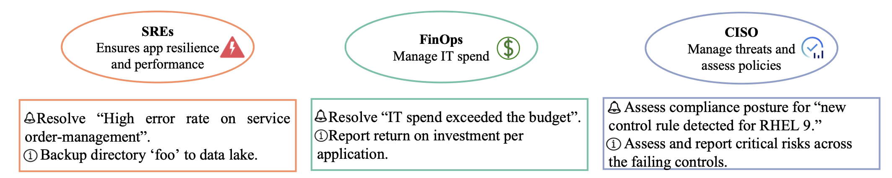

# ITBench

**[Paper](./it_bench_arxiv.pdf) | [Leaderboard](#leaderboard) | [Scenarios](#scenarios) | [Agents](#agents) | [How to Cite](#how-to-cite) | [Contributors](./CONTRIBUTORS.md) | [Contacts](#contacts)**

---

## 📢 Announcements

### Latest Updates
- **[June 13, 2025]** Identified 25+ additional scenarios to be developed over the summer.
- **[May 2, 2025]** 🚀 ITBench now provides **fully-managed scenario environments** for everyone! Our platform handles the complete workflow—from scenario deployment to agent evaluation and leaderboard updates. Visit our GitHub repository [here](https://github.com/ibm/ITBench-Leaderboard) for guidelines and get started today.
- **[February 28, 2025]** 🏆 **Limited Access Beta**: Invite-only access to the ITBench hosted scenario environments. ITBench handles scenario deployment, agent evaluation, and leaderboard updates. To request access, e-mail us [here](mailto:agent-bench-automation@ibm.com).
- **[February 7, 2025]** 🎉 **Initial release!** Includes research paper, self-hosted environment setup tooling, sample scenarios, and baseline agents.

---

## Overview

ITBench measures the performance of AI agents across a wide variety of **complex and real-world inspired IT automation tasks** targeting three key use cases:

| Use Case | Focus Area |
|----------|------------|
| **SRE** (Site Reliability Engineering) | Availability and resiliency |
| **CISO** (Compliance & Security Operations) | Compliance and security enforcement |
| **FinOps** (Financial Operations) | Cost efficiencies and ROI optimization |



### Key Features

- **Real-world representation** of IT environments and incident scenarios  
- **Open, extensible framework** with comprehensive IT coverage  
- **Push-button workflows** and interpretable metrics  
- **Kubernetes-based** scenario environments  

### What's Included

ITBench enables researchers and developers to replicate real-world incidents in Kubernetes environments and develop AI agents to address them.

**We provide:**
1. **Push-button deployment tooling** for environment setup *(open-source)*
2. **Framework for recreating realistic IT scenarios using the deployment tooling:**
   - **6 SRE scenarios** and **21 mechanisms** *(open-source)*
   - **4 categories of CISO scenarios** *(open-source)*
   - **1 FinOps scenario** *(open-source)*
3. **Two reference AI agents:**
   - SRE (Site Reliability Engineering) Agent *(open-source)*
   - CISO (Chief Information Security Officer) Agent *(open-source)*
4. **Fully-managed leaderboard** for agent evaluation and comparison

---

## Roadmap

| Timeline | Key Deliverables |
|----------|------------------|
| **July 2025** | • Refactor leading to a scenario specification generator and runner allowing for most (if not all) mechanisms to be re-used across diverse applications and microservices<br/> • Implementation of 10 of the additional scenarios identified |
| **August 2025** | • **SRE-Agent-Lite**: Lightweight agent to assist non-systems personnel with environment debugging<br/>• **Snapshot & Replay**: Data capture and replay capabilities<br/> • Implementation of 15 of the additional scenarios to be developed over the summer|
| **Fall 2025** | **BYOA (Bring Your Own Application)**: Support for custom application integration |

---

## Leaderboard

The ITBench Leaderboard tracks agent performance across SRE, FinOps, and CISO scenarios. We provide fully managed scenario environments while researchers/developers run their agents on their own systems and submit their outputs for evaluation.

| Domain | Leaderboard |
|--------|-------------|
| **SRE**     | [View SRE Leaderboard](https://github.com/itbench-hub/ITBench/blob/main/LEADERBOARD_SRE.md) |
| **CISO**    | [View CISO Leaderboard](https://github.com/itbench-hub/ITBench/blob/main/LEADERBOARD_CISO.md) |

> **Get Started**: Visit [docs/leaderboard.md](docs/leaderboard.md) for access and evaluation guidelines.

---

## Scenarios

ITBench incorporates a collection of problems that we call **scenarios**. Each scenario is deployed in an operational environment where specific problems occur.

### Examples of Scenarios
- **SRE**: Resolve "High error rate on service checkout" in a Kubernetes environment
- **CISO**: Assess compliance posture for "new control rule detected for RHEL 9"
- **FinOps**: Identify and resolve cost overruns and anomalies

**Find all scenarios**: [Scenarios repository](https://github.com/IBM/ITBench-Scenarios)

---

## Agents

Two baseline agents are being open-sourced with ITBench, built using the **CrewAI framework**.

### Agent Features
- **Configurable LLMs**: watsonx, Azure, or vLLM support
- **Natural language tools**: Interactions with the environment for information gathering

### Available Agents

| Agent | Repository |
|-------|------------|
| **SRE Agent** | [itbench-sre-agent](https://github.com/IBM/itbench-sre-agent) |
| **CISO Agent** | [itbench-ciso-caa-agent](https://github.com/IBM/itbench-ciso-caa-agent) |

---

## How to Cite

```bibtex
@misc{jha2025itbench,
      title={ITBench: Evaluating AI Agents across Diverse Real-World IT Automation Tasks},
      author={Jha, Saurabh and Arora, Rohan and Watanabe, Yuji and others},
      year={2025},
      url={https://github.com/IBM/itbench-sample-scenarios/blob/main/it_bench_arxiv.pdf}
}
```

---

## Join the Discussion

Have questions or need help getting started with ITBench?

- [**Create a GitHub issue**](https://github.com/IBM/ITBench/issues/new) for bug reports or feature requests
- [**Join our Discord community**](https://discord.gg/6fzy3JRHmt) for real-time discussions
- For formal inquiries, please see the [contacts section](#contacts)

---

## Contacts

- **General inquiries**: agent-bench-automation@ibm.com
- **Saurabh Jha**: saurabh.jha@ibm.com
- **Yuji Watanabe**: muew@jp.ibm.com
