# ITBench-Leaderboard

## 🌟 Explore the Leaderboards

| Domain | Leaderboard |
|--------|-------------|
| 🔐 **CISO**    | 👉 [View CISO Leaderboard](../LEADERBOARD_CISO.md) |
| ⚙️ **SRE**     | 👉 [View SRE Leaderboard](../LEADERBOARD_SRE.md) |

## Getting Started
### Prerequisites
- **A private GitHub repository**
  - A file facilitating the agent and leaderboard handshake is pushed to this private repository.
  - The file(s) may be created or deleted automatically during the benchmark lifecycle.
- **A Kubernetes sandbox cluster (KinD recommended)** -- Only needed for CISO 
  - Do not use a production cluster, because the benchmark process will create and delete resources dynamically.
  - Please refer to [prepare-kubeconfig-kind.md](https://github.com/itbench-hub/ITBench-Scenarios/blob/main/ciso/prepare-kubeconfig-kind.md)
- **An agent to benchmark**
  - A base agent is available from IBM for immediate use. The base agent for the CISO use case can be found [here](https://github.com/itbench-hub/ITBench-CISO-CAA-Agent), and one for SRE and FinOps use cases can be found [here](https://github.com/itbench-hub/ITBench-SRE-Agent). This allows you to leverage your methodologies and make improvements without having to worry about interactions between the agent and leaderboard service.

### Setup

#### Step 1. Install the ITBench GitHub App
Install the ibm-itbench GitHub app into the private GitHub repository (see Prerequisites).

1. Go to the installation page [here](https://github.com/apps/ibm-itbench-github-app).

    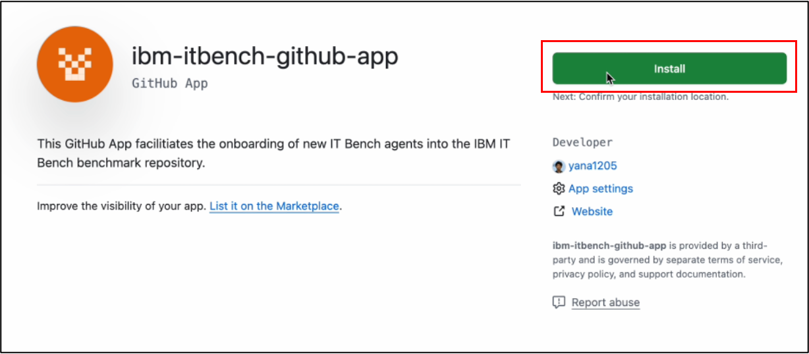
2. Select your GitHub Organization.

    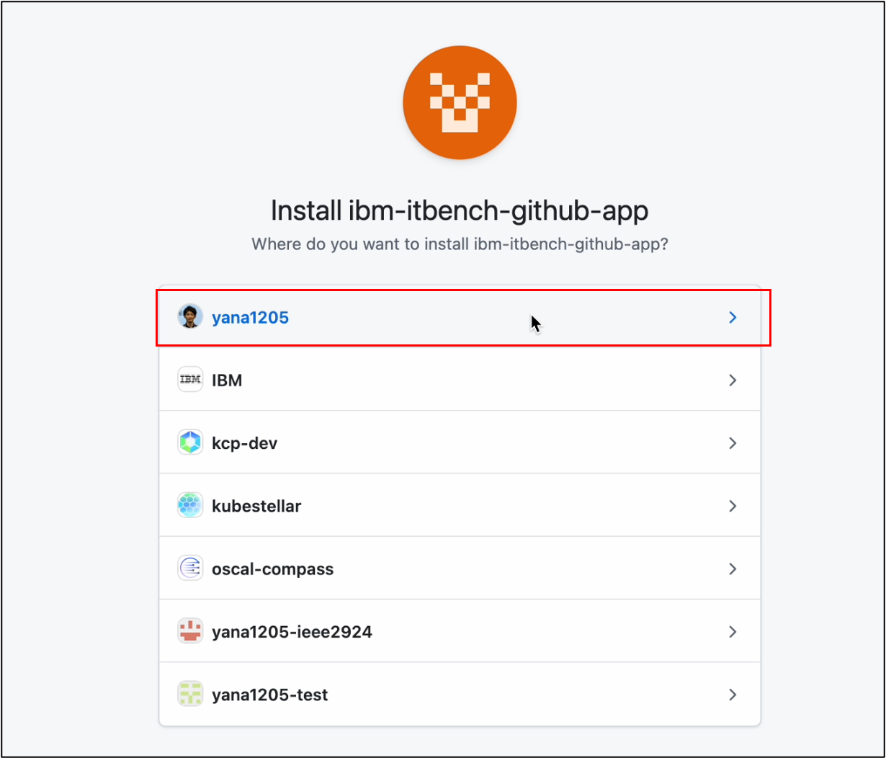
3. Select your Agent configuration repo.

    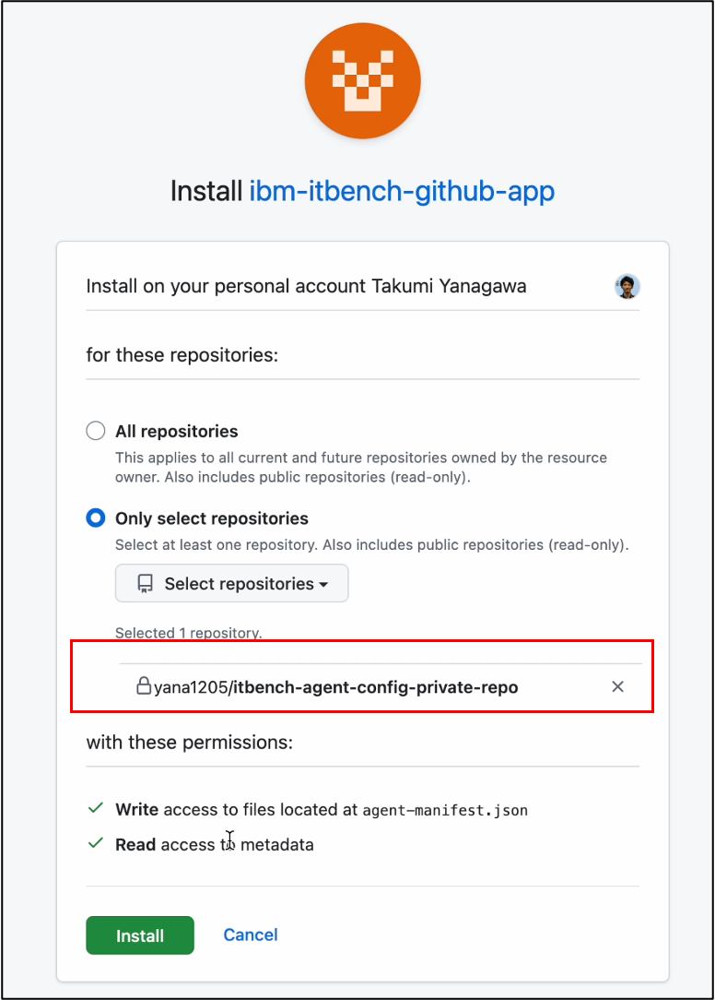

#### Step 2. Register your agent
In this step, you will register your agent information with ITBench. 

1. Create a new registration issue.
    - Go to [Agent Registration Form](https://github.com/itbench-hub/ITBench/issues/new/choose) and create a new issue.
        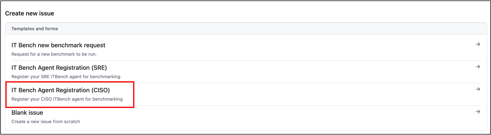
2. Fill in the issue template with the following information:
    - Agent Name: Your agent name
    - Agent Level: "Beginner"
    - Agent Scenarios: "Kubernetes in Kyverno"
    - Config Repo: URL for your agent configuration repo
    (You may adjust the settings depending on the scenarios or agent level.)

        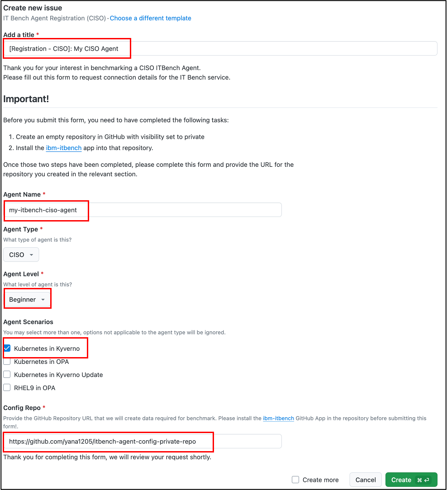
3. Submit the issue.
  - Click "Create" to submit your registration request.
  - Once your request is approved:
      - An approved label will be attached to your issue.
      - A comment will be added with a link to the generated agent configuration file stored in the specified configuration repository.
    Download the linked configuration file to proceed.
          
          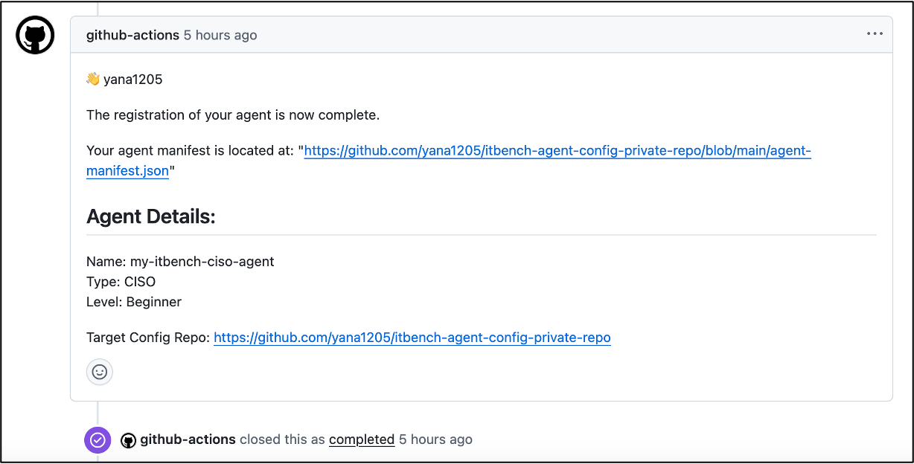
  - If you subscribe to the issue, you will also receive email notifications.
      
      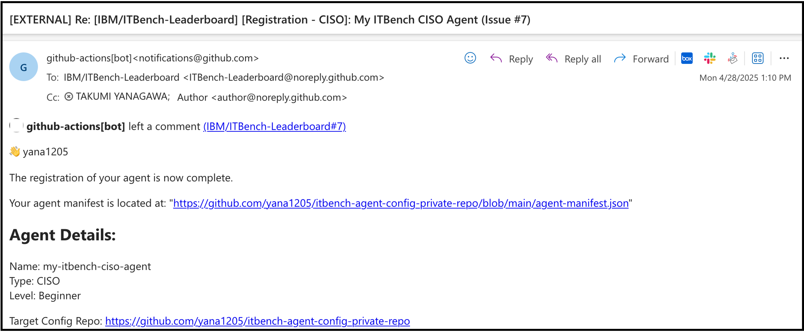

If there are any problems with your submission, we will respond directly on the issue.
If you do not receive any response within a couple of days, please reach out to the [maintainers](../README.md#contacts).

#### Step 3. Create a benchmark request 
In this step, you will register your benchmark entry.
1. Create a new benchmark issue.
    - Go to [Benchmark Registration Form](https://github.com/itbench-hub/ITBench/issues/new/choose) and create a new issue.

        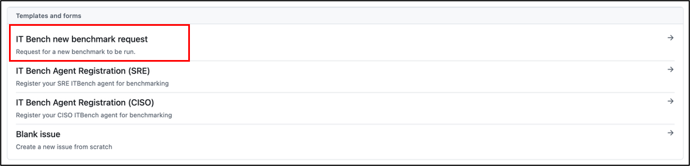
2. Fill in the issue template.
    - The name for the Config Repo must match the repository you used during agent registration.

        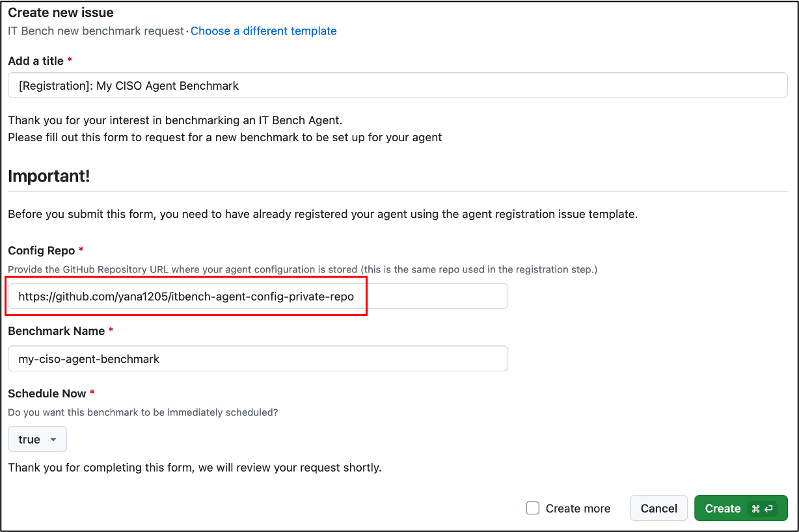
3. Submit the issue.
    - Click "Create" to submit your registration request. Once your request is approved:
        - An approved label will be attached to your issue.
        - The issue comment will be updated with your Benchmark ID.
              
        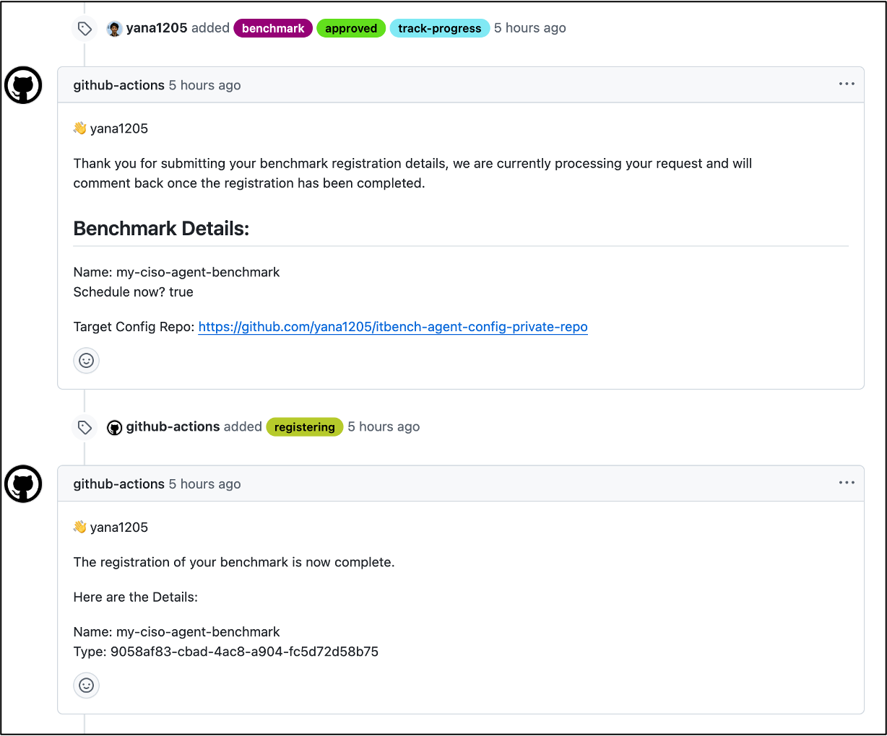
    - If you subscribe to the issue, you will also receive email notifications.
          
        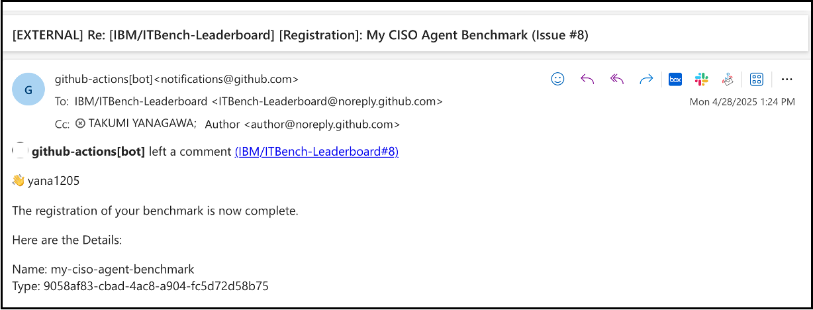

If there are any problems with your submission, we will respond directly on the issue.
If you do not receive any response within a couple of days, please reach out to the [maintainers](../README.md#contacts).

### Running your agent or our base agent against the benchmark
You can run either your own custom agent or one of our built-in agents against the ITBench benchmark.

The following guides and videos demonstrate how to run the benchmark using our built-in agents. These may also serve as helpful references when setting up your own agent:
  
- **CISO Agent** – [Documentation](docs/how-to-launch-benchmark-ciso.md) ・ [Demo Video](https://ibm.box.com/s/3i7mapxyit7ugnbldigqunzs6bkvv4cy)
- **SRE Agent** – [Documentation](https://github.com/itbench-hub/ITBench-SRE-Agent/blob/main/Leaderboard.md)
